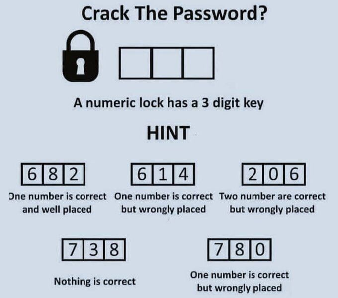

# Password Riddle Solver

A Python script that solves the famous WhatsApp "3-digit password riddle" through systematic checking of all possible combinations against given hints. Because making a program to solve it was actually easier than solving it manually.

## The Riddle

The riddle presents a 3-digit numeric lock with 5 hints:
- 682: One number is correct and well placed
- 614: One number is correct but wrongly placed
- 206: Two numbers are correct but wrongly placed
- 738: Nothing is correct
- 780: One number is correct but wrongly placed

The correct answer is: 042

## How It Works

The script uses a systematic approach to:
1. Try all possible 3-digit combinations (000-999)
2. Check each combination against all 5 hints
3. Track both exact matches (correct number in correct position) and partial matches (correct number in wrong position)
4. Return all valid solutions that satisfy all hints

## Usage

Run the script:
python pass_riddle.py

The script will output all valid solutions found.

## Implementation Details

The solution uses two main functions:
1. check_guess(): Verifies if a potential password matches a specific hint's conditions
2. find_all_passwords(): Systematically checks all possible combinations

Key features:
- Handles duplicate digits correctly
- Distinguishes between exact and partial matches
- Returns all valid solutions, not just the first match
- Uses efficient position tracking to prevent double-counting

## Solution Explanation

042 is the correct answer because:
- 682: 2 is correct and well placed
- 614: 4 is correct but in wrong position
- 206: 0 and 2 are correct but in wrong positions
- 738: No digits match (correct)
- 780: 0 is correct but in wrong position

## Contributing

Feel free to open issues or submit pull requests if you have:
- Optimizations for the solution
- Alternative solving approaches
- Additional test cases
- Documentation improvements

## License

This project is licensed under the MIT License. See the [LICENSE](LICENSE) file for details.

## Author

[@Silenttttttt](https://github.com/Silenttttttt)
